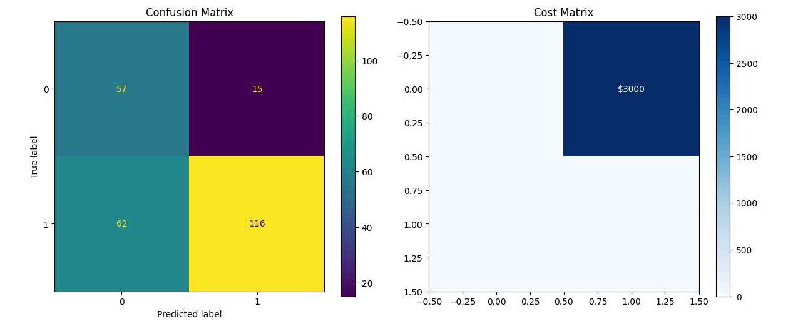
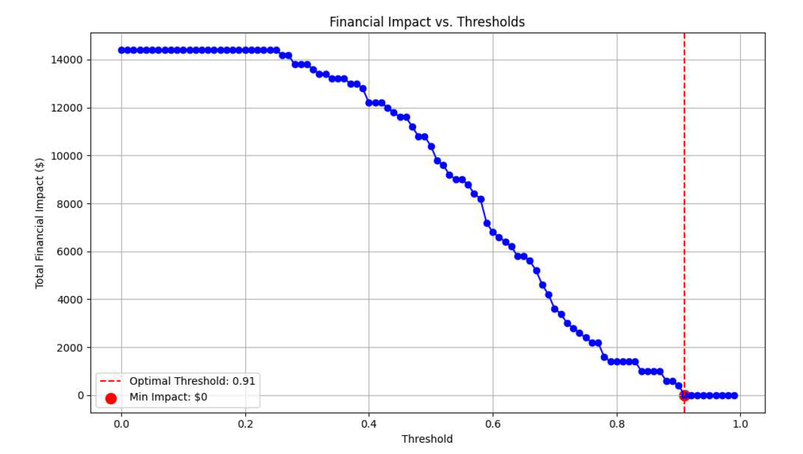
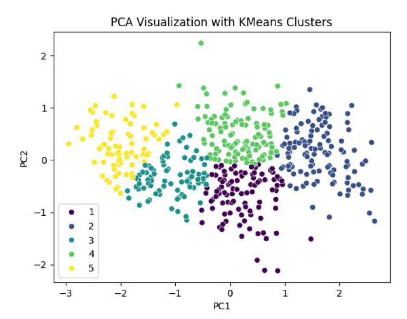
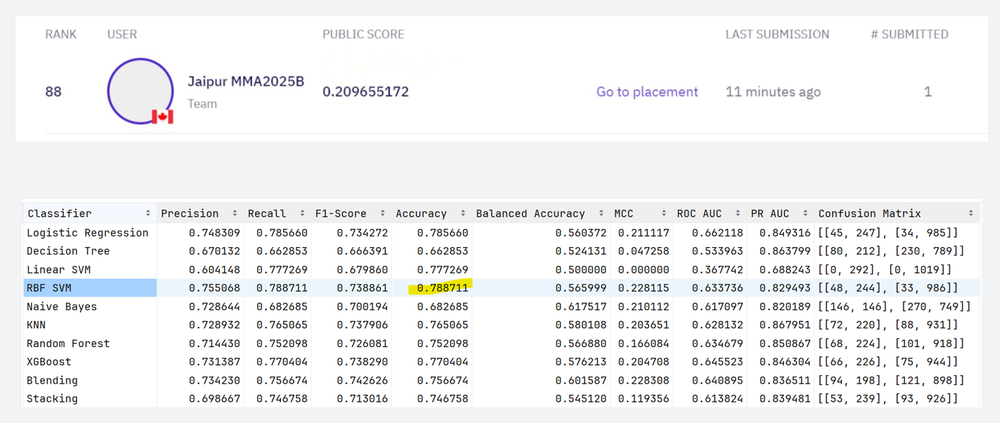
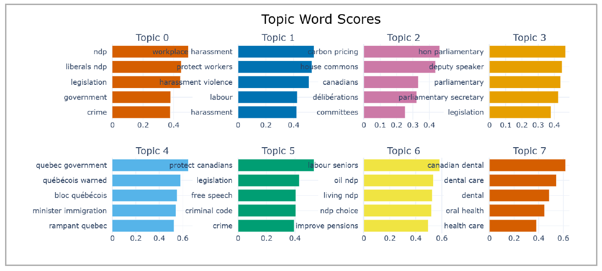
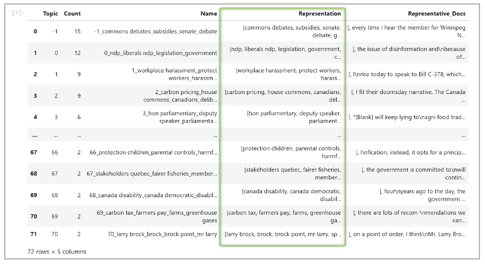
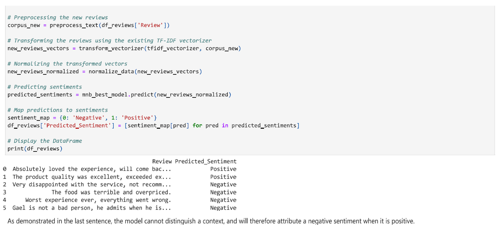

## Data Scientist Portfolio

Welcome to my project portfolio. Below are six selected projects comprised of individual and team-based projects that demonstrate my expertise in applying machine learning, natural language processing, and data analysis to solve complex business problems. Each project highlights an end-to-end workflow, from data preprocessing and model development to delivering actionable, data-driven insights.

***

## 💳 Project 1: Advanced Credit Risk Modeling & Profit Maximization Strategy - Individual Project

**Objective:** To move beyond standard classification accuracy and develop a credit risk model that optimizes for tangible business outcomes. This project focused on building a model to predict loan defaults and then fine-tuning its decision threshold to align with two distinct financial strategies: **minimizing contingency reserves** and **maximizing overall profit**.

**Key Skills & Technologies:**
* **Modeling**: Supervised Learning (Classification), Logistic Regression, Random Forest, XGBoost, Support Vector Machines (SVM)
* **Business Application**: Cost-Benefit Analysis, Opportunity Cost Modeling, Financial Impact Assessment
* **Tech Stack**: Python, Scikit-learn, Pandas, NumPy, Matplotlib, Seaborn
* **Techniques**: Hyperparameter Tuning (GridSearchCV), Feature Engineering (Log Transformation), Class Imbalance Handling, Cost Matrix Implementation

---

### Methodology & Execution

1.  **Data Preparation**: I began with the German Credit dataset, performing thorough Exploratory Data Analysis (EDA). To handle outliers in financial features like 'Amount', I applied a **log transformation**, ensuring a more robust model.
2.  **Strategic Modeling**: I trained and rigorously evaluated a suite of classification algorithms. The core of this project was developing two custom evaluation frameworks based on business needs:
    * **Scenario A (Minimize Reserves)**: I created a **value matrix** where False Positives (predicting a bad loan as 'Good') incurred a **$200 loss**. I then iterated through different classification thresholds to identify the point that minimized this total expected loss.
    * **Scenario B (Maximize Profit)**: I engineered a more sophisticated **net profit matrix**. This model accounted not only for the $200 loss on False Positives but also for the **$50 profit** from True Positives (correctly approved good loans) and the **$50 opportunity cost** of False Negatives (incorrectly denying a good customer).

### Results & Business Impact 📈

This project demonstrated a clear ability to translate model metrics into business value, showing that the "best" model depends entirely on the strategic goal.

* **For Minimizing Reserves**: The optimal model was a **Random Forest Classifier with a tuned threshold of 0.91**. This aggressive threshold effectively reduced the financial institution's required contingency reserve to **$0**.
* **For Maximizing Profit**: Interestingly, a simpler **Logistic Regression model with an optimal threshold of 0.72** proved superior. It achieved a maximum **net profit of $800** on the test set, delivering a **$1,100 marginal profit increase** compared to the Random Forest model in the same scenario.

This analysis provides a clear, data-driven framework for the financial institution to adjust its lending strategy based on its current risk appetite and profitability goals.

***

## 🎯 Project 2: Unsupervised Customer Segmentation for Persona Development - Individual Project

**Objective:** To analyze a diverse customer base and apply unsupervised learning to segment customers into distinct, actionable personas. The goal was to provide the marketing team with a clear understanding of their customer base to enable targeted marketing strategies.

**Key Skills & Technologies:**
* **Modeling**: Unsupervised Learning (Clustering), K-Means
* **Data Science**: Dimensionality Reduction (PCA), Feature Scaling (`StandardScaler`), Data Visualization
* **Tech Stack**: Python, Scikit-learn, Pandas, Plotly, Seaborn

---

### Methodology & Execution

1.  **Data Exploration & Preprocessing**: I started with a comprehensive EDA on the customer dataset, which included demographic and behavioral features. All features were standardized using `StandardScaler` to ensure that each contributed equally to the clustering algorithm.
2.  **Determining Optimal Clusters**: To scientifically determine the ideal number of segments, I employed two key techniques:
    * **The Elbow Method**: To identify the point of diminishing returns in cluster variance.
    * **Silhouette Analysis**: To measure how similar an object is to its own cluster compared to other clusters.
    Both methods pointed towards an optimal structure of **5 distinct customer clusters**.
3.  **Clustering & Visualization**: I applied the **K-Means algorithm** with k=5 to segment the customers. To visualize these high-dimensional clusters, I used **Principal Component Analysis (PCA)** to reduce the data to its two most significant components, allowing for a clear 2D representation of the distinct personas.

### Results & Business Impact 💡

* Successfully segmented the entire customer base into **5 well-defined and statistically significant personas**.
* The final PCA visualization provided a clear and intuitive map of the customer landscape.
* Delivered actionable insights for each persona by analyzing their cluster centers, enabling the marketing team to move from a one-size-fits-all approach to highly targeted strategies, improving engagement and ROI.

***

## 🏆 Project 3: Competitive Machine Learning - Loan Default Prediction  - Team-based Project

**Objective:** To develop a high-performing classification model to predict loan defaults as part of a competitive challenge on the Zindi platform.

**Key Skills & Technologies:**
* **Modeling**: Machine Learning Competitions, Team Collaboration, Advanced Feature Engineering, Model Stacking & Ensembling, Hyperparameter Optimization (GridSearchCV), Support Vector Machines (SVC), XGBoost.
* **Collaboration Tools**: Zindi Platform, Shared Notebooks
* **Tech Stack**: Python, Scikit-learn, Pandas

---

### Methodology & Execution

1.  **Team Collaboration & Data Integration**: Working within a multi-person team, our first task was to merge and clean several raw datasets, including loan applications, historical loan data, and customer demographics.
2.  **Iterative Modeling**: We adopted a structured and iterative approach to modeling. We began by establishing a benchmark with baseline models. We then progressively improved performance by:
    * Engineering new, more predictive features.
    * Applying extensive **hyperparameter tuning** using `GridSearchCV`.
    * Testing various modeling architectures, including bagging and ensembling methods.
3.  **Performance Benchmarking**: All models were rigorously evaluated based on their F1 Score and the official competition metric, allowing us to track our progress and select the most promising approach for our final submission.

### Results & Impact 🏅

* Our final model, a highly tuned **Support Vector Classifier (SVC)**, achieved a **top 30 rank** on the competitive Zindi leaderboard.
* The model produced an impressive **F1 Score of 0.87** and a **Precision of 0.79**, demonstrating high reliability in a real-world, competitive scenario.
* This project highlights my ability to collaborate effectively in a fast-paced environment and deliver high-performing models under pressure.

***

## 🏛️ Project 4: NLP-Powered Topic Modeling for Parliamentary Analysis - Team-based Project

**Objective:** To design and validate a proof-of-concept for an AI platform that automates topic detection from Canadian Parliamentary Debates (Hansards). The goal was to drastically reduce the manual effort required by parliamentary researchers to analyze over 100,000 words of text per session and to improve the speed and accuracy of identifying legislative trends.

**Key Skills & Technologies:**
* **Modeling**: Natural Language Processing (NLP), Topic Modeling, BERTopic, Latent Dirichlet Allocation (LDA), Non-Negative Matrix Factorization (NMF).
* **LLMs**: Model Fine-tuning (Hugging Face "Instructor XL").
* **Tech Stack**: Python, Scikit-learn, Pandas.
* **Techniques**: Text Preprocessing (Lemmatization, Stop Word Removal), Dimensionality Reduction (UMAP), Clustering (HDBSCAN).

---

### Methodology & Execution

1.  **Model Comparison**: As part of a team, I conducted a comparative analysis of three topic modeling techniques to find the most effective solution. We evaluated traditional models (LDA, NMF) against a modern, transformer-based approach (BERTopic) on a sample Hansard transcript containing 471 speeches.
2.  **Preprocessing & Initial Analysis**: We performed standard NLP preprocessing, including stop word removal, bigram generation, and lemmatization. Our initial analysis with **NMF** successfully identified 8 distinct and interpretable topics, validating the feasibility of the project.
3.  **Advanced Model Selection**: While NMF was effective, we selected **BERTopic as the core of our proposed solution** due to its superior architecture, which leverages sentence transformers for more nuanced contextual understanding. This approach also allows for powerful enhancements, such as fine-tuning with a Large Language Model (LLM).

### Results & Business Impact 🚀

This proof-of-concept laid out a clear, data-driven strategy for the Library of the Canadian Parliament to modernize its research capabilities.

* **Superior Performance**: The **BERTopic** model significantly outperformed the others, identifying **73 granular topics** compared to NMF's 8 and LDA's poor-quality topics, demonstrating its ability to capture more detailed insights.
* **Massive Efficiency Gains**: The proposed system was projected to **process 100 Hansard documents in under 3 minutes**, a task that would take a human researcher 45 hours.
* **Significant Cost Reduction**: The automation was estimated to save **25-30 hours of manpower per week**, leading to a projected **60% cost reduction** in document processing and a 72% reduction in manual quality checks.

***

## 💬 Project 5: Sentiment Analysis of Customer Reviews - Individual Project

**Objective:** To build and evaluate a machine learning pipeline for classifying text-based customer reviews as either positive or negative. This project demonstrates an end-to-end NLP workflow, from data cleaning and preprocessing to model training, optimization, and interpretation.

**Key Skills & Technologies:**
* **Modeling**: Supervised Learning (Classification), Logistic Regression, Multinomial Naive Bayes, Random Forest, XGBoost.
* **NLP**: Text Preprocessing (Lemmatization, Stop Word Removal), Feature Extraction (`TfidfVectorizer`).
* **Tech Stack**: Python, Scikit-learn, Pandas, NLTK, Matplotlib.
* **Techniques**: Hyperparameter Tuning (`GridSearchCV`), Model Interpretation.

---

### Methodology & Execution

1.  **Exploratory Data Analysis (EDA)**: I began by analyzing the sentiment dataset, confirming that the classes were balanced (approximately 49.5% positive, 50.5% negative), which meant no special techniques for class imbalance were needed. I also analyzed sentence length and word frequency to understand the corpus.
2.  **Text Preprocessing Pipeline**: I created a robust preprocessing function to clean the raw text data. This involved converting text to lowercase, removing non-alphabetic characters, tokenizing sentences, removing common English stop words, and performing **lemmatization** to standardize words to their root form.
3.  **Modeling and Optimization**: The cleaned text was converted into numerical vectors using **TF-IDF**. I then trained four different classification models and used `GridSearchCV` to find the optimal hyperparameters for each, ensuring a fair and rigorous comparison.

### Results & Business Impact 📊

* After hyperparameter tuning and comparison, the **Multinomial Naive Bayes model** was selected as the top performer, achieving an **Accuracy of 76.2%** and an **F1-Score of 75.0%** on the unseen test data.
* The model provides a reliable, automated tool for businesses to quickly gauge customer sentiment from large volumes of reviews, enabling faster response times and better brand monitoring.
* Through model interpretation, I identified a key limitation: the model struggled with nuanced language and negation (e.g., classifying "Gael is not a bad person" as negative), highlighting the need for more advanced, context-aware models like BERT for future iterations.

***

## ⚖️ Project 6: AI Strategy and Proof-of-Concept for Legal Document Processing with Legal-BERT - Individual Project

**Objective:** To design a proof-of-concept for a "Smart Document Processing" platform to automate the review of legal contracts at a large law firm. The proposed AI system aims to solve the business problem of slow, costly, and error-prone manual contract analysis.

**Key Skills & Technologies:**
* **Modeling**: Transformer Models (Legal-BERT), Large Language Models (LLMs).
* **AI Strategy**: Proof of Concept (POC) Design, ROI Analysis, MLOps, Cloud Architecture.
* **Tech Stack**: Amazon Web Services (AWS), Amazon SageMaker, Hugging Face.
* **NLP Tasks**: Document Classification, Named Entity Recognition, Summarization, Q&A.

---

### Methodology & Proposed Execution

1.  **Problem Analysis**: I identified that a typical large company manages 20,000 to 40,000 active contracts, creating a significant bottleneck for legal teams.
2.  **Solution Architecture**: I proposed a solution built around a specialized, pre-trained language model, **Legal-BERT**, fine-tuned on the firm's internal documents. The system is designed for deployment on a scalable and secure cloud infrastructure using **Hugging Face on Amazon SageMaker**.
3.  **Intelligent Workflow**: The system would ingest documents via **Amazon Textract** and use the fine-tuned Legal-BERT model to perform tasks like classification and entity extraction. A key innovation is a confidence-based routing system: documents with high model confidence are sent directly to lawyers, while low-confidence documents are flagged for paralegal review, optimizing the use of expert time.

### Projected Business Impact & ROI 💰

This strategic proposal outlines how to leverage cutting-edge AI to transform a core legal function, delivering significant value.

* **Drastic Time Savings**: The AI platform is projected to **accelerate the document review pipeline by 4x**, reducing the required paralegal time from 384 hours per week to just 96.
* **High-Value Automation**: The system is designed to automate a range of NLP tasks beyond simple review, including summarization and question-answering, turning static documents into queryable knowledge bases.
* **Substantial Cost Reduction**: The proposed implementation is estimated to achieve a **60% cost reduction** in document processing and a **72% reduction** in manual data entry and quality checks.
